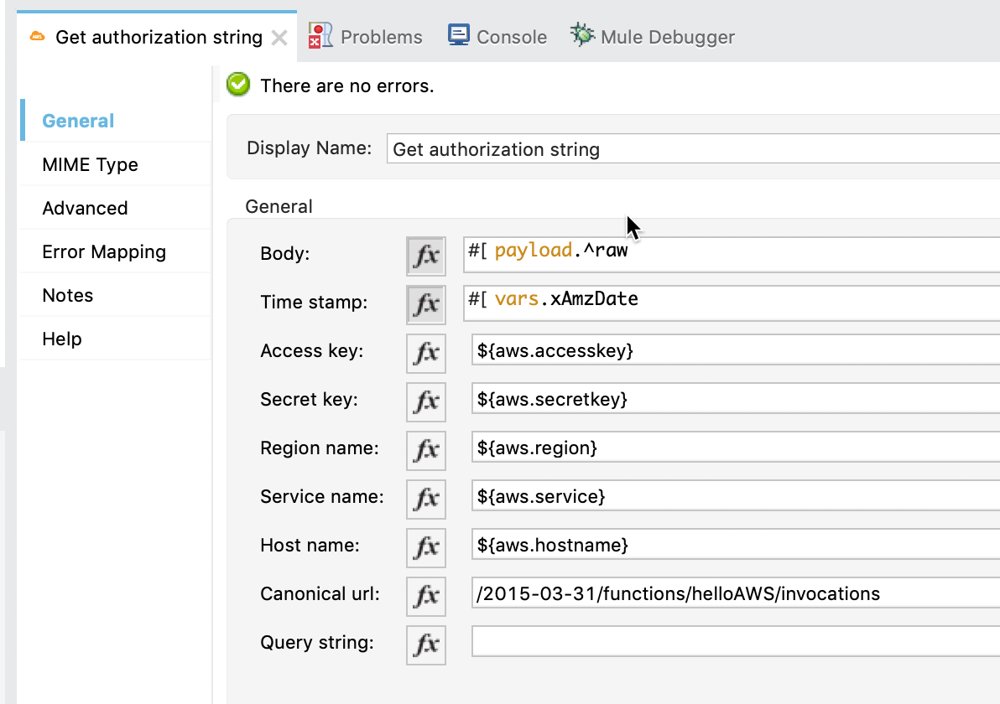

= AWS Signature Version 4 Connector
:imagesdir: ./
_CONNECTOR_SUPPORT_CATEGORY_

The AWS Signature Version 4 connector provides the ability to generate a AWS Signature Version 4 to call an AWS service over HTTPS.

== Prerequisites
This document assumes that you are familiar with Mule, Anypoint Connectors, Anypoint Studio, Mule flows, and Mule Global Elements. See the Release Notes for compatibility information listed in the See Also section of this document.

== What's New in this Connector
This is the first release of the connector.

== To Connect in Design Center
[List steps to specify a trigger and the connector] - Show screenshots for the trigger setup and for configuring the connector.

=== Test the Connector
[List how to test that the connector works via Design Center]

== To Install this Connector in Anypoint Studio 7
. In Anypoint Studio 7, click Add Module and specify the name of the connector.
. Click Add to add the connector to your project.
. When Studio has an update, a message displays in the lower right corner, which you can click to install the update.

== To Create a Mule Project in Anypoint Studio 7
[screenshot of flow, screenshot of configuration screen(s), table of field descriptions]

=== To Create a Mule Project Using XML
[source,xml,linenums]
<awsv4auth:get-authorization-string doc:name="Get Authorization String" accessKey="${aws.accesskey}" secretKey="${aws.secretkey}" regionName="${aws.region}" serviceName="${aws.service}" canonicalURL="/2015-03-31/functions/helloAWS/invocations" timeStamp="#[vars.xAmzDate]" body="#[payload.^raw]" hostName="${aws.hostname}"/>

=== To Run and Test a Mule Flow
Explain how to run the application and test the connector.

== Example: AWS Signature Version 4
This example demonstrates the use of AWS Signature Version 4 connector.
To build and run this demo project you need:

* Anypoint Studio with at least Mule 4.1.4 Runtime.

=== To Configure this Example
[Explain how to configure this example. Don't repeat screenshots from the configuration section above.]

=== To Test the Example
[Explain how to test that the example works]

=== About the XML Flow
[source,xml,linenums]
<flow name="aws-sig-v4-example-mule4Flow" doc:id="1dd79553-1a8d-4586-b9ff-ab183adf848a" >
  <http:listener doc:name="/hello" doc:id="1c98da1c-1da8-4b4f-8394-1f061d01da24" config-ref="HTTP_Listener_config" path="/hello"/>
  <set-variable value="#[output application/json --- (now() &gt;&gt; &quot;UTC&quot;) as DateTime  {format:&quot;yyyyMMdd'T'HHmmss'Z'&quot;}]" doc:name="xAmzDate" doc:id="097fcc10-3934-49c3-bc5f-5263e27a9b6b" variableName="xAmzDate"/>
  <awsv4auth:get-authorization-string doc:name="Get authorization string" doc:id="d0d15939-057f-4e61-9058-ec4d185f3224" accessKey="${aws.accesskey}" secretKey="${aws.secretkey}" regionName="${aws.region}" serviceName="${aws.service}" canonicalURL="/2015-03-31/functions/helloAWS/invocations" timeStamp="#[vars.xAmzDate]" target="authString" body="#[payload]" hostName="${aws.hostname}"/>
  <http:request method="POST" doc:name="Call AWS Lambda" doc:id="b2a2bee1-dfbb-4246-85e7-8907b432e15a" path="/2015-03-31/functions/helloAWS/invocations" config-ref="HTTP_Request_configuration" sendCorrelationId="NEVER">
    <http:headers ><![CDATA[#[output application/java
    ---
    {
    "Authorization" : vars.authString,
    "Content-Type" : "application/json",
    "X-Amz-Date" : vars.xAmzDate ++ "",
    "Host" : "lambda.us-east-1.amazonaws.com"
    }]]]>
    </http:headers>
  </http:request>
</flow>

== See Also
* link:release-notes.adoc[AWS Signature Version 4 Release Notes]
